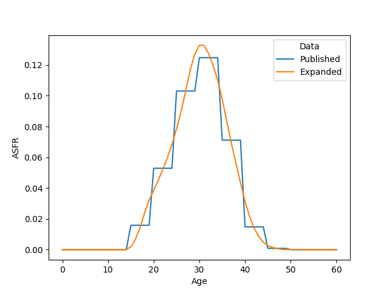

<!-- README.md is generated from README.Rmd. Please edit that file -->

```{r, include = FALSE}
knitr::opts_chunk$set(
  collapse = TRUE,
  comment = "#>"
)

knitr::opts_chunk$set(
  engine.path = list(octave = "C:/Program Files/GNU Octave/Octave-11.1.0/mingw64/bin/octave-11.1.0.exe",
                     ruby="ruby") 
)
```

# Osier

<!-- badges: start -->
<!-- badges: end -->

Osier is a software library for preparing and analysing demographic data. It has interfaces for [Excel](#excel), [R](#r), [Python](#python), [Octave](#octave), and [Ruby](#ruby).
Each interface includes basic information on each function. The Osier [website](https://sdyrting.github.io/Osier/) gives further information on underlying methodologies and configuration settings.

## Excel {#excel}

The addin `ExcelOSR` provides an  Excel interface to Osier. To install it, follow these steps:

1. Determine whether your version of Excel is 32-bit or 64-bit: For versions prior to Excel 2013,  go to  File&rarr;Help&rarr;About Excel. For Excel 2013 or later, go to File&rarr;Account&rarr;About Excel. 
1. Download and unzip the appropriate file (eg `Osier10_Win32_20250725.zip` for 32-bit Excel, `Osier10_x64_20250725.zip` for 64-bit Excel). 
1. Open Excel and install the addin `ExcelOSR\ExcelOSR.xla`. 
1. Close and restart Excel. 


Help pages and example spreadsheets can be accessed via the Osier drop-down menu on the Add-ins tab. I recommend users select the Manual Calculation Option in Excel Options&rarr;Formulas.  


## R {#r}

The package `RprojOSR` provides an R interface to Osier. You can install it from its binary package:

``` r
install.packages('RprojOSR_1.0.0.zip')
```

### Example

Create an object using population, fertility, mortality, or migration data.

```{r example, warning=FALSE, message=FALSE}
library(RprojOSR)
library(tidyverse)
library(ggplot2)

#
# Create a fertility object
#

asfr <- aus_f_asfr_2011

fert_name <- 'Published'
osr.CreateObj(fert_name,'FERTILITY',
              c('Population','Date','BuildMethod'),
              list('AUS-P/AUS-F',20110630,'CONSTANT_FERT'),
              'FertilityRates',
              c('Age','Rate','Use'),
              matrix(ncol=3,byrow=FALSE,data=c(asfr$age,asfr$rate,asfr$use)))
```

Objects can be copied or modified.

```{r}

#
# Copy an object
#

xfert_name <- 'Expanded'
osr.CloneObj(xfert_name,fert_name,'FERTILITY')

#
# Modify an object
#

osr.ModifyObj(,xfert_name,'FERTILITY',,'BuildMethod',,'HFC:70000')

```

There are functions for calculating demographic rates and measures.

```{r asfr}

#
# Calculate measures
#

# Age-specific fertility rate
tibble(Age=seq(0,60)) %>%
  cross_join(tibble(Data=c(fert_name,xfert_name))) %>%
  group_by(Data,Age) %>%
  mutate(ASFR=osr.FertRate(Data,Age)) %>%
  ggplot()+
  geom_line(aes(x=Age,y=ASFR,group=Data,colour=Data))
```

```{r}


# Total fertility rate
osr.TotalFertRate(xfert_name)

# Mean age at childbearing
osr.MeanAgeChild(xfert_name)
```

Objects persist until they are explicitly deleted.

```{r}
# Check an object exists
osr.GetObj(xfert_name,'FERTILITY')

# Delete all objects
osr.DeleteObjs(,'')

# Check object has been deleted
osr.GetObj(xfert_name,'FERTILITY')
```

Example scripts are available in the `osr_examples` folder in the package directory^[Run `find.package('RprojOSR')` to get the package directory]. The package documentation has basic information on each function and vignettes giving examples of Osier in action. 

## Python {#python}

The package PythonOSR provides a Python interface to the Osier library of demographic functions.

### Installation

You can install PythonOSR from its wheel:

``` python
pip install pythonosr-0.0.0.9000-cp313-cp313-win_amd64.whl
```

### Example

Create an object using population, fertility, mortality, or migration data.


```{python}
import pythonosr.osr as osr
import pythonosr.data as osrd #Example datasets
import pandas as pd
import seaborn as sns
import matplotlib.pyplot as plt

#
# Create a fertility object
#

asfr=osrd.load('aus_f_asfr_2011')

fert_name='Published'
osr.CreateObj(fert_name,'FERTILITY',
              ['Population','Date','BuildMethod'],
              ['AUS-P/AUS-F',20110630,'CONSTANT_FERT'],
              'FertilityRates',
              asfr.columns.tolist(),
              asfr.values.tolist())


```

Objects can be copied or modified.

```{python}

#
# Copy an object
#

xfert_name = 'Expanded'
osr.CloneObj(xfert_name,fert_name,'FERTILITY')

#
# Modify an object
#

osr.ModifyObj(None,xfert_name,'FERTILITY',None,'BuildMethod',None,'HFC:70000')

```

There are functions for calculating demographic rates and measures.

```{python}

#
# Calculate measures
#


# Age-specific fertility rate
fert_df=pd.DataFrame({'Age': range(0,61)}).merge(
  pd.DataFrame({'Data': [fert_name,xfert_name]}),how='cross')
fert_df['ASFR']=fert_df.apply(lambda x: osr.FertRate(x.Data,x.Age), axis=1)
sns.lineplot(data=fert_df,x='Age',y='ASFR',hue='Data')
plt.show()
```

```{python}


# Total fertility rate
osr.TotalFertRate(xfert_name)

# Mean age at childbearing
osr.MeanAgeChild(xfert_name)
```

Objects persist until they are explicitly deleted.

```{python}
# Check an object exists
osr.GetObj(xfert_name,'FERTILITY')

# Delete all objects
osr.DeleteObjs(None,'')

# Check object has been deleted
osr.GetObj(xfert_name,'FERTILITY')
```

Example scripts are available in the `osr_examples` folder in the package directory^[Run `pip show pythonosr` to get the package directory].

# Octave {#octave}

The package OctaveOSR provides an Octave interface to the Osier library of demographic functions.

## Installation

You can install OctaveOSR from its package file:

``` octave
octave:1> pkg install OctaveOSR-0.0.0.9000-x86_64-Msys-oct-11.1.0.tar.gz
```

## Example

Create an object using population, fertility, mortality, or migration data.


```{octave}
pkg load octaveosr
pkg load dataframe
warning off;

h=osr();

#
# Create a fertility object
#

asfr=osrd.load_dataset("aus_f_asfr_2011");

fert_name="Published";
CreateObj(h,fert_name,'FERTILITY',...
              {'Population','Date','BuildMethod'},...
              {'AUS-P/AUS-F',20110630,'CONSTANT_FERT'}',...
              'FertilityRates',...
              cellstr(asfr.colnames),...
              asfr{})
```

Objects can be copied or modified.

```{octave}
pkg load octaveosr
pkg load dataframe
warning off;

h=osr();
asfr=osrd.load_dataset("aus_f_asfr_2011");
fert_name="Published";
CreateObj(h,fert_name,'FERTILITY',...
              {'Population','Date','BuildMethod'},...
              {'AUS-P/AUS-F',20110630,'CONSTANT_FERT'}',...
              'FertilityRates',...
              cellstr(asfr.colnames),...
              asfr{});

#
# Copy an object
#

xfert_name = 'Expanded';
CloneObj(h,xfert_name,fert_name,'FERTILITY')

#
# Modify an object
#

ModifyObj(h,'',xfert_name,'FERTILITY','','BuildMethod','','HFC:70000')
```


There are functions for calculating demographic rates and measures.

```{octave}
pkg load octaveosr
pkg load dataframe
warning off;

h=osr();
asfr=osrd.load_dataset("aus_f_asfr_2011");
fert_name="Published";
CreateObj(h,fert_name,'FERTILITY',...
              {'Population','Date','BuildMethod'},...
              {'AUS-P/AUS-F',20110630,'CONSTANT_FERT'}',...
              'FertilityRates',...
              cellstr(asfr.colnames),...
              asfr{});
xfert_name = 'Expanded';
ModifyObj(h,xfert_name,fert_name,'FERTILITY','','BuildMethod','','HFC:70000');

#
# Calculate measures
#


# Age-specific fertility rate
Data={fert_name,xfert_name};
Age=0:60;
ASFR=zeros(size(Age));
hold on;
for i=1:length(Data)
  for j=1:length(Age)
    ASFR(j)=FertRate(h,Data(i),Age(j));
  endfor
  plot(Age,ASFR);
endfor
xlabel('Age');
ylabel('ASFR');
legend(Data);
hold off;
print('README_files/figure-gfm/octave_asfr_plot.png')

# Total fertility rate
TotalFertRate(h,xfert_name)

# Mean age at childbearing
MeanAgeChild(h,xfert_name)
```


Objects persist until they are explicitly deleted.

```{octave}
pkg load octaveosr
pkg load dataframe
warning off;

h=osr();
asfr=osrd.load_dataset("aus_f_asfr_2011");
fert_name="Published";
CreateObj(h,fert_name,'FERTILITY',...
              {'Population','Date','BuildMethod'},...
              {'AUS-P/AUS-F',20110630,'CONSTANT_FERT'}',...
              'FertilityRates',...
              cellstr(asfr.colnames),...
              asfr{});
xfert_name = 'Expanded';
ModifyObj(h,xfert_name,fert_name,'FERTILITY','','BuildMethod','','HFC:70000');

# Check an object exists
GetObj(h,xfert_name,'FERTILITY')

# Delete all objects
DeleteObjs(h,'',{''})

# Check object has been deleted
GetObj(h,xfert_name,'FERTILITY')
```

Example scripts are available in the `osr_examples` folder in the package directory^[Run `pkg list` to get the installation directory of all packages].

```{octave}
pkg load octaveosr
warning off;

methods osr;

help @osr/FertRate;
```

# Ruby {#ruby}

The package RubyOSR provides a Ruby interface to the Osier library of demographic functions.

## Installation

You can install RubyOSR from its gem:

``` ruby
> gem install rubyosr-0.0.0.9000.gem
```

## Example

Create an object using population, fertility, mortality, or migration data.


```{ruby, eval=TRUE}
require 'rubyosr'
require 'osrd' #For bundled data

h=Osier.new

#
# Create a fertility object
#

asfr=Osrd.load_dataset("aus_f_asfr_2011")

fert_name="Published"
table_cols = asfr.headers
table_values = asfr.to_a.drop(1)

ans=h.CreateObj(fert_name,'FERTILITY',
              ['Population','Date','BuildMethod'],
              ['AUS-P/AUS-F',20110630,'CONSTANT_FERT'],
              'FertilityRates',
              table_cols,
              table_values)
puts ans
```

Objects can be copied or modified.

```{ruby, eval=TRUE}
require 'rubyosr'
require 'osrd'

h=Osier.new

asfr=Osrd.load_dataset("aus_f_asfr_2011")
fert_name="Published";
puts h.CreateObj(fert_name,'FERTILITY',
              ['Population','Date','BuildMethod'],
              ['AUS-P/AUS-F',20110630,'CONSTANT_FERT'],
              'FertilityRates',
              asfr.headers,
              asfr.to_a.drop(1))

#
# Copy an object
#

xfert_name = 'Expanded'
puts h.CloneObj(xfert_name,fert_name,'FERTILITY')

#
# Modify an object
#

puts h.ModifyObj(nil,xfert_name,'FERTILITY',nil,'BuildMethod',nil,'HFC:70000')
```

There are functions for calculating demographic rates and measures.

```{ruby, eval=TRUE}
require 'rubyosr'
require 'osrd'
require 'polars-df'
require 'charty'
require 'matplotlib'

Charty::Backends.use(:pyplot)
Matplotlib.use(:agg)

h=Osier.new
asfr=Osrd.load_dataset("aus_f_asfr_2011")
fert_name="Published"
h.CreateObj(fert_name,'FERTILITY',
              ['Population','Date','BuildMethod'],
              ['AUS-P/AUS-F',20110630,'CONSTANT_FERT'],
              'FertilityRates',
              asfr.headers,
              asfr.to_a.drop(1))
xfert_name = 'Expanded'
h.ModifyObj(xfert_name,fert_name,'FERTILITY',nil,'BuildMethod',nil,'HFC:70000')

#
# Calculate measures
#

# Age-specific fertility rate
df=Polars::DataFrame.new({
  Data: [fert_name,xfert_name]
}).join(
  Polars::DataFrame.new({
  Age: 0.step(60,1).to_a
}), how: 'cross'
).with_columns(
  ASFR: Polars.struct(["Data","Age"]).map_elements(return_dtype: Polars::Float64) {|row| h.FertRate(row["Data"],row["Age"])}
)

plot_data = {
  'Age': df["Age"].to_a,
  'Data': df["Data"].to_a,
  'ASFR': df["ASFR"].to_a
}
Charty.line_plot(data: plot_data, x: :Age, y: :ASFR, color: :Data).save('README_files/figure-gfm/ruby_asfr_plot.png')

# Total fertility rate
puts h.TotalFertRate(xfert_name)

# Mean age at childbearing
puts h.MeanAgeChild(xfert_name)
```


Objects persist until they are explicitly deleted.

```{ruby, eval=TRUE}
require 'rubyosr'
require 'osrd'

h=Osier.new
asfr=Osrd.load_dataset("aus_f_asfr_2011")
fert_name="Published"
h.CreateObj(fert_name,'FERTILITY',
              ['Population','Date','BuildMethod'],
              ['AUS-P/AUS-F',20110630,'CONSTANT_FERT'],
              'FertilityRates',
              asfr.headers,
              asfr.to_a.drop(1))
xfert_name = 'Expanded'
h.ModifyObj(xfert_name,fert_name,'FERTILITY',nil,'BuildMethod',nil,'HFC:70000')

# Check an object exists
puts h.GetObj(xfert_name,'FERTILITY')

# Delete all objects
puts h.DeleteObjs(nil,'')

# Check object has been deleted
puts h.GetObj(xfert_name,'FERTILITY')
```