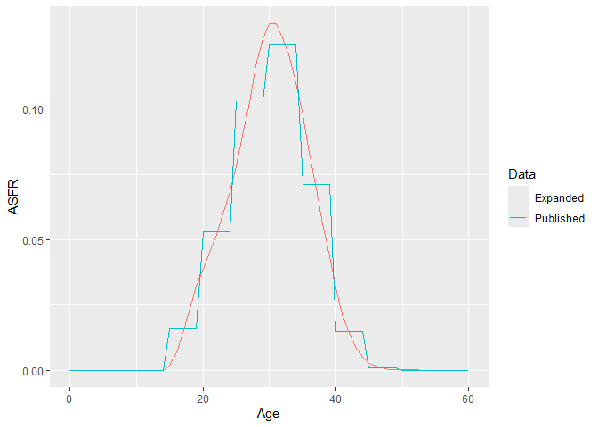
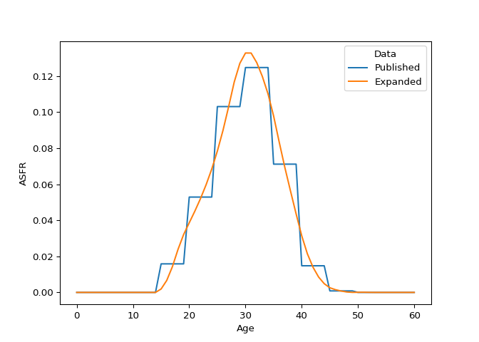
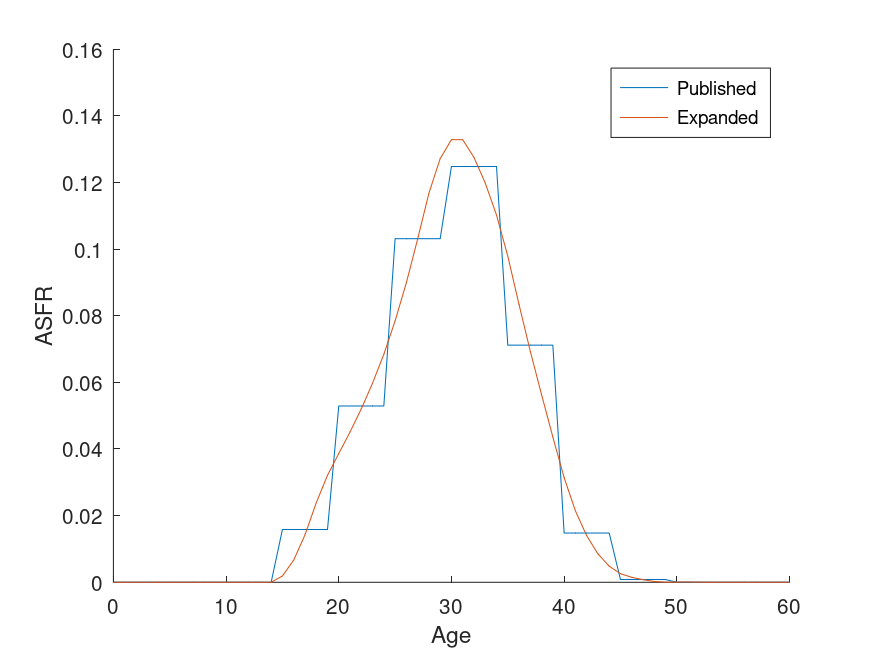

<!-- README.md is generated from README.Rmd. Please edit that file -->

# Osier

<!-- badges: start -->

<!-- badges: end -->

Osier is a software library for preparing and analysing demographic
data. It has interfaces for [Excel](#excel), [R](#r), [Python](#python),
and [Octave](#octave).

## Excel

The addin `ExcelOSR` provides an Excel interface to Osier. To install
it, follow these steps:

1.  Determine whether your version of Excel is 32-bit or 64-bit: For
    versions prior to Excel 2013, go to File→Help→About Excel. For Excel
    2013 or later, go to File→Account→About Excel.
2.  Download and unzip the appropriate file (eg
    `Osier10_Win32_20250725.zip` for 32-bit Excel,
    `Osier10_x64_20250725.zip` for 64-bit Excel).
3.  Open Excel and install the addin `ExcelOSR\ExcelOSR.xla`.
4.  Close and restart Excel.

Help pages and example spreadsheets can be accessed via the Osier
drop-down menu on the Add-ins tab. I recommend users select the Manual
Calculation Option in Excel Options→Formulas. The help pages can also be
found on the Osier [website](https://sdyrting.github.io/Osier/).

## R

The package `RprojOSR` provides an R interface to Osier. You can install
it from its binary package:

``` r
install.packages('RprojOSR_1.0.0.zip')
```

### Example

Create an object using population, fertility, mortality, or migration
data.

``` r
library(RprojOSR)
library(tidyverse)
library(ggplot2)

#
# Create a fertility object
#

asfr <- aus_f_asfr_2011

fert_name <- 'Published'
osr.CreateObj(fert_name,'FERTILITY',
              c('Population','Date','BuildMethod'),
              list('AUS-P/AUS-F',20110630,'CONSTANT_FERT'),
              'FertilityRates',
              c('Age','Rate','Use'),
              matrix(ncol=3,byrow=FALSE,data=c(asfr$age,asfr$rate,asfr$use)))
#> [1] "Published:0"
```

Objects can be copied or modified.

``` r

#
# Copy an object
#

xfert_name <- 'Expanded'
osr.CloneObj(xfert_name,fert_name,'FERTILITY')
#> [1] "Expanded:0"

#
# Modify an object
#

osr.ModifyObj(,xfert_name,'FERTILITY',,'BuildMethod',,'HFC:70000')
#> [1] "Expanded:1"
```

There are functions for calculating demographic rates and measures.

``` r

#
# Calculate measures
#

# Age-specific fertility rate
tibble(Age=seq(0,60)) %>%
  cross_join(tibble(Data=c(fert_name,xfert_name))) %>%
  group_by(Data,Age) %>%
  mutate(ASFR=osr.FertRate(Data,Age)) %>%
  ggplot()+
  geom_line(aes(x=Age,y=ASFR,group=Data,colour=Data))
```

<!-- -->

``` r


# Total fertility rate
osr.TotalFertRate(xfert_name)
#> [1] 1.9169

# Mean age at childbearing
osr.MeanAgeChild(xfert_name)
#> [1] 30.5433
```

Objects persist until they are explicitly deleted.

``` r
# Check an object exists
osr.GetObj(xfert_name,'FERTILITY')
#> [1] "Expanded:1"

# Delete all objects
osr.DeleteObjs(,'')
#> [1] "Deleted 2 objects."

# Check object has been deleted
osr.GetObj(xfert_name,'FERTILITY')
#> [1] "Object Expanded of type FERTILITY does not exist."
```

Example scripts are available in the `osr_examples` folder in the
package directory[^1]. The package documentation has basic information
on each function and vignettes giving examples of Osier in action. The
Osier [website](https://sdyrting.github.io/Osier/) gives further
information on underlying methodologies and configuration settings.

## Python

The package PythonOSR provides a Python interface to the Osier library
of demographic functions.

### Installation

You can install PythonOSR from its wheel:

``` python
pip install pythonosr-0.0.0.9000-cp313-cp313-win_amd64.whl
```

### Example

Create an object using population, fertility, mortality, or migration
data.

``` python
import pythonosr.osr as osr
import pythonosr.data as osrd #Example datasets
import pandas as pd
import seaborn as sns
import matplotlib.pyplot as plt

#
# Create a fertility object
#

asfr=osrd.load('aus_f_asfr_2011')

fert_name='Published'
osr.CreateObj(fert_name,'FERTILITY',
              ['Population','Date','BuildMethod'],
              ['AUS-P/AUS-F',20110630,'CONSTANT_FERT'],
              'FertilityRates',
              asfr.columns.tolist(),
              asfr.values.tolist())
#> 'Published:0'
```

Objects can be copied or modified.

``` python

#
# Copy an object
#

xfert_name = 'Expanded'
osr.CloneObj(xfert_name,fert_name,'FERTILITY')
#> 'Expanded:0'

#
# Modify an object
#

osr.ModifyObj(None,xfert_name,'FERTILITY',None,'BuildMethod',None,'HFC:70000')
#> 'Expanded:1'
```

There are functions for calculating demographic rates and measures.

``` python

#
# Calculate measures
#


# Age-specific fertility rate
fert_df=pd.DataFrame({'Age': range(0,61)}).merge(
  pd.DataFrame({'Data': [fert_name,xfert_name]}),how='cross')
fert_df['ASFR']=fert_df.apply(lambda x: osr.FertRate(x.Data,x.Age), axis=1)
sns.lineplot(data=fert_df,x='Age',y='ASFR',hue='Data')
plt.show()
```



``` python


# Total fertility rate
osr.TotalFertRate(xfert_name)
#> 1.9169

# Mean age at childbearing
osr.MeanAgeChild(xfert_name)
#> 30.543299211686886
```

Objects persist until they are explicitly deleted.

``` python
# Check an object exists
osr.GetObj(xfert_name,'FERTILITY')
#> 'Expanded:1'

# Delete all objects
osr.DeleteObjs(None,'')
#> 'Deleted 2 objects.'

# Check object has been deleted
osr.GetObj(xfert_name,'FERTILITY')
#> 'Object Expanded of type FERTILITY does not exist.'
```

Example scripts are available in the `osr_examples` folder in the
package directory[^2]. The package documentation has basic information
on each function. The Osier [website](https://sdyrting.github.io/Osier/)
gives further information on underlying methodologies and configuration
settings.

# Octave

The package OctaveOSR provides an Octave interface to the Osier library
of demographic functions.

## Installation

You can install OctaveOSR from its package file:

``` octave
octave:1> pkg install OctaveOSR-0.0.0.9000-x86_64-Msys-oct-11.1.0.tar.gz
```

## Example

Create an object using population, fertility, mortality, or migration
data.

``` octave
pkg load octaveosr
pkg load dataframe
warning off;

h=osr();

#
# Create a fertility object
#

asfr=osrd.load_dataset("aus_f_asfr_2011");

fert_name="Published";
CreateObj(h,fert_name,'FERTILITY',...
              {'Population','Date','BuildMethod'},...
              {'AUS-P/AUS-F',20110630,'CONSTANT_FERT'}',...
              'FertilityRates',...
              cellstr(asfr.colnames),...
              asfr{})
#> ans = Published:0
```

Objects can be copied or modified.

``` octave
pkg load octaveosr
pkg load dataframe
warning off;

h=osr();
asfr=osrd.load_dataset("aus_f_asfr_2011");
fert_name="Published";
CreateObj(h,fert_name,'FERTILITY',...
              {'Population','Date','BuildMethod'},...
              {'AUS-P/AUS-F',20110630,'CONSTANT_FERT'}',...
              'FertilityRates',...
              cellstr(asfr.colnames),...
              asfr{});

#
# Copy an object
#

xfert_name = 'Expanded';
CloneObj(h,xfert_name,fert_name,'FERTILITY')

#
# Modify an object
#

ModifyObj(h,'',xfert_name,'FERTILITY','','BuildMethod','','HFC:70000')
#> ans = Expanded:0
#> ans = Expanded:1
```

There are functions for calculating demographic rates and measures.

``` octave
pkg load octaveosr
pkg load dataframe
warning off;

h=osr();
asfr=osrd.load_dataset("aus_f_asfr_2011");
fert_name="Published";
CreateObj(h,fert_name,'FERTILITY',...
              {'Population','Date','BuildMethod'},...
              {'AUS-P/AUS-F',20110630,'CONSTANT_FERT'}',...
              'FertilityRates',...
              cellstr(asfr.colnames),...
              asfr{});
xfert_name = 'Expanded';
ModifyObj(h,xfert_name,fert_name,'FERTILITY','','BuildMethod','','HFC:70000');

#
# Calculate measures
#


# Age-specific fertility rate
Data={fert_name,xfert_name};
Age=0:60;
ASFR=zeros(size(Age));
hold on;
for i=1:length(Data)
  for j=1:length(Age)
    ASFR(j)=FertRate(h,Data(i),Age(j));
  endfor
  plot(Age,ASFR);
endfor
xlabel('Age');
ylabel('ASFR');
legend(Data);
hold off;
print('README_files/figure-gfm/octave_asfr_plot.png')

# Total fertility rate
TotalFertRate(h,xfert_name)

# Mean age at childbearing
MeanAgeChild(h,xfert_name)
#> ans = 1.9169
#> ans = 30.543
```



Objects persist until they are explicitly deleted.

``` octave
pkg load octaveosr
pkg load dataframe
warning off;

h=osr();
asfr=osrd.load_dataset("aus_f_asfr_2011");
fert_name="Published";
CreateObj(h,fert_name,'FERTILITY',...
              {'Population','Date','BuildMethod'},...
              {'AUS-P/AUS-F',20110630,'CONSTANT_FERT'}',...
              'FertilityRates',...
              cellstr(asfr.colnames),...
              asfr{});
xfert_name = 'Expanded';
ModifyObj(h,xfert_name,fert_name,'FERTILITY','','BuildMethod','','HFC:70000');

# Check an object exists
GetObj(h,xfert_name,'FERTILITY')

# Delete all objects
DeleteObjs(h,'',{''})

# Check object has been deleted
GetObj(h,xfert_name,'FERTILITY')
#> ans = Expanded:0
#> ans = Deleted 2 objects.
#> ans = Object Expanded of type FERTILITY does not exist.
```

Example scripts are available in the `osr_examples` folder in the
package directory[^3]. The package documentation has basic information
on each function.

``` octave
pkg load octaveosr
warning off;

methods osr;

help @osr/FertRate;
#> Methods for class osr:
#> Append                     ListObjs
#> Births                     ListToMatrix
#> CalibReturnMigration       LoadLibrary
#> ClearAllResults            LoadObjs
#> CloneObj                   LoadObjsFromDataDirectory
#> ColSort                    MakeGrid
#> CountryAlpha2ToNum         MakeMatrix
#> CountryAlpha3ToNum         MakeVector
#> CountryNameToNum           MatrixInterp
#> CountryNumToAlpha2         MatrixToList
#> CountryNumToAlpha3         MeanAgeChild
#> CountryNumToName           MedianAge
#> CreateObj                  MigrationProb
#> CreateOneYearMig           MigrationRatio
#> CreateScenarioMort         ModalDeathAge
#> DeathDist                  ModifyObj
#> DeathProb                  MultiYearMigrationProb
#> DeathRate                  NetReproRate
#> Deaths                     Number
#> DeleteObjs                 Osier
#> DisplayAllResults          OutSurvival
#> DisplayObj                 PushResult
#> DisplayObjLabels           Resize
#> DisplaySubtableNames       SDSurvFrac
#> DyingProb                  SDYearsLived
#> ErrorFlag                  SDYearsLivedAfter
#> FertRate                   SaveObjs
#> FillMatrix                 StartLog
#> GetError                   StopLog
#> GetFertParams              SurvFrac
#> GetMigrationParams         SurvProb
#> GetMortParams              TotalFertRate
#> GetObj                     TotalNumber
#> GetObjInfo                 WLTranspose
#> GetPCurveParams            YearsLived
#> GridToObject               YearsLivedAfter
#> GroupedProb                addParameter
#> GroupedRatio               close
#> InterpMatrixValue          display
#> LifeDisp                   makeFunctionCall
#> LifeExp                    newFunction
#> LineInt                    osr
#> 
#> '@osr/FertRate' is a function from the file C:\Users\sdyrting\AppData\Roaming\octave\api-v61\packages\octaveosr-0.0.0.9000\@osr\FertRate.m
#> 
#>  -- Function FileRETVAL=: FertRate
#>           (osr_obj,FERTHANDLE,AGE,_AGEINTERVAL_)
#> 
#>      Returns the age-specific fertility rate for age interval
#>      [Age,Age+AgeInterval).
#> 
#>      FERTHANDLE
#>           The fertility handle
#> 
#>      AGE
#>           The age.
#> 
#>      _AGEINTERVAL_
#>           Optional.  The age interval.  If not specified it defaults to
#>           1.0
#> 
#> Additional help for built-in functions and operators is
#> available in the online version of the manual.  Use the command
#> 'doc <topic>' to search the manual index.
#> 
#> Help and information about Octave is also available on the WWW
#> at https://www.octave.org and https://octave.discourse.group/c/help/
```

The Osier [website](https://sdyrting.github.io/Osier/) gives further
information on underlying methodologies and configuration settings.

[^1]: Run `find.package('RprojOSR')` to get the package directory

[^2]: Run `pip show pythonosr` to get the package directory

[^3]: Run `pkg list` to get the installation directory of all packages
